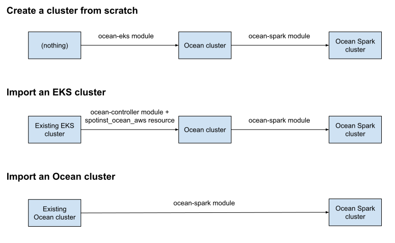

# terraform-spotinst-ocean-spark

A Terraform module to install the [Ocean for Apache Spark](https://spot.io/products/ocean-apache-spark/) data platform.

### :warning: Ocean for Apache Spark is currently only available on AWS.

## Overview

This module imports an existing Ocean cluster into Ocean Spark.
It can be combined with other Ocean Terraform modules to support a number of installation methods for Ocean Spark:
1. Create an Ocean Spark cluster from scratch in your cloud account
2. Import an existing EKS cluster into Ocean Spark
3. Import an existing Ocean cluster into Ocean Spark

The diagram below details those different installation methods.
Read on for more details.

### 1. Create an Ocean Spark cluster from scratch

In this case, use the [`ocean-eks` Terraform module](https://registry.terraform.io/modules/spotinst/ocean-eks/spotinst/latest) to create an Ocean cluster from scratch.
Then, use the `ocean-spark` Terraform module (this module) to import the cluster into Ocean Spark.

Folder [`examples/eks-ocean/`](examples/eks-ocean/) contains a full example.

### 2. Import an existing EKS cluster

In this case, use the [`ocean-controller` Terraform module](https://registry.terraform.io/modules/spotinst/ocean-controller/spotinst/latest) and the [`spotinst_ocean_aws` Terraform resource](https://registry.terraform.io/providers/spotinst/spotinst/latest/docs/resources/ocean_aws) to import the EKS cluster into Ocean.
Then, use the `ocean-spark` Terraform module (this module) to import the resulting Ocean cluster into Ocean Spark.

A full example will be available soon.

### 3. Import an existing Ocean cluster

In this case, use the `ocean-spark` Terraform module (this module) to import the existing Ocean cluster into Ocean Spark.

Folder [`examples/exisiting-ocean-cluster/`](examples/exisiting-ocean-cluster/) contains a full example.

## Terraform module documentation

<!-- BEGIN_TF_DOCS -->
### Requirements

| Name | Version |
|------|---------|
|  [terraform](#requirement\_terraform) | >= 0.13.1 |
|  [kubernetes](#requirement\_kubernetes) | ~> 2.0 |

### Providers

| Name | Version |
|------|---------|
|  [kubernetes](#provider\_kubernetes) | ~> 2.0 |

### Modules

No modules.

### Resources

| Name | Type |
|------|------|
| [kubernetes_cluster_role_binding.deployer](https://registry.terraform.io/providers/hashicorp/kubernetes/latest/docs/resources/cluster_role_binding) | resource |
| [kubernetes_job.deployer](https://registry.terraform.io/providers/hashicorp/kubernetes/latest/docs/resources/job) | resource |
| [kubernetes_namespace.spot-system](https://registry.terraform.io/providers/hashicorp/kubernetes/latest/docs/resources/namespace) | resource |
| [kubernetes_service_account.deployer](https://registry.terraform.io/providers/hashicorp/kubernetes/latest/docs/resources/service_account) | resource |

### Inputs

| Name | Description | Type | Default | Required |
|------|-------------|------|---------|:--------:|
|  [create\_cluster](#input\_create\_cluster) | Controls whether the Ocean for Apache Spark cluster should be created (it affects all resources) | `bool` | `true` | no |
|  [deployer\_image](#input\_deployer\_image) | Specifies the Docker image name used in the deployer Job | `string` | `"public.ecr.aws/f4k1p1n4/bigdata-deployer"` | no |
|  [deployer\_tag](#input\_deployer\_tag) | Specifies the Docker image tag used in the deployer Job | `string` | `"main"` | no |
|  [image\_pull\_policy](#input\_image\_pull\_policy) | Specifies the image pull policy (one of: Always, Never, IfNotPresent) | `string` | `"Always"` | no |

### Outputs

No outputs.
<!-- END_TF_DOCS -->
